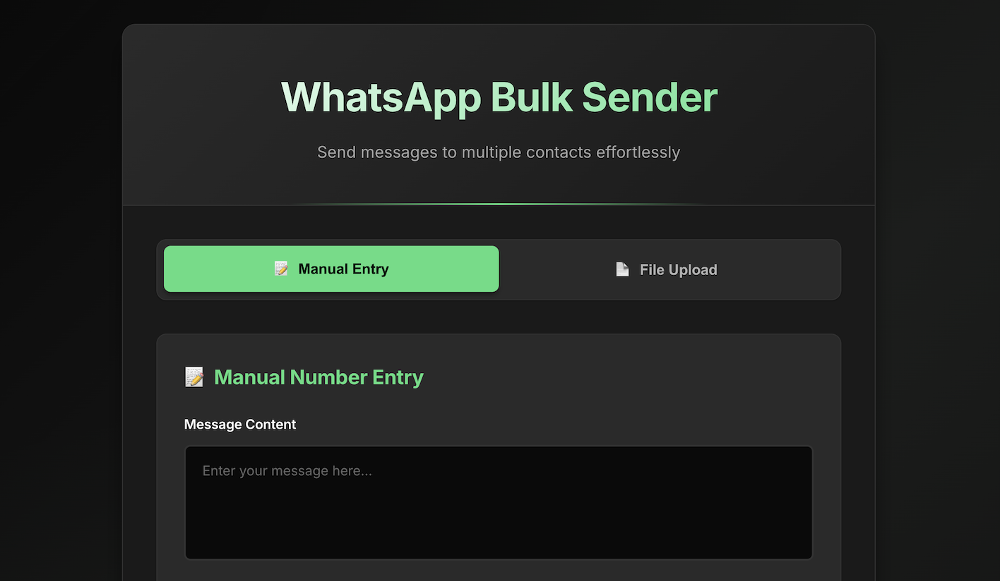
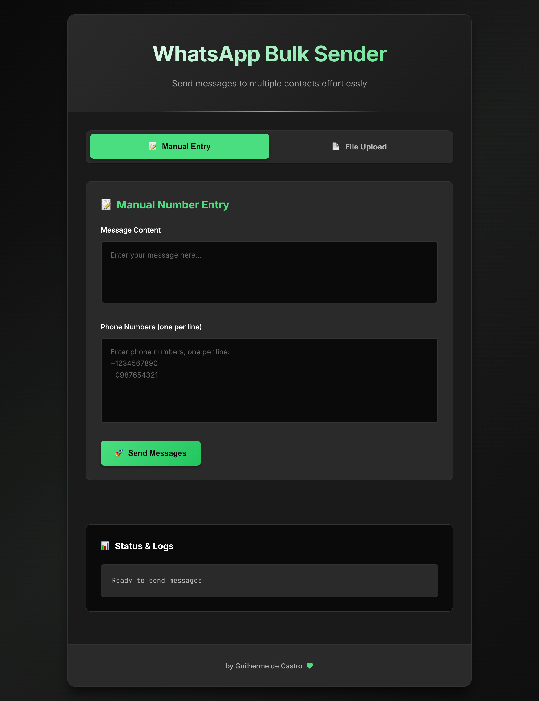

# WhatsApp Bulk Sender



A modern, tabbed, dark-themed web interface to send WhatsApp messages to multiple numbers, either by pasting numbers manually or uploading a CSV/Excel file. The backend uses FastAPI and a browser automation controller to deliver messages, with clear logging and status updates.

> Tip: Place screenshots in `public/images/` and they will render below. The folder is currently empty, so add images like `banner.png` and `interface.png`.

## Features
- Tabbed interface: `Manual Entry` and `File Upload`
- Modern dark theme with light green accents
- Real-time validation and user feedback
- File upload for CSV/Excel with automatic normalization
- Responsive layout and accessible typography
- Status panel with clear API responses
- Footer credit: "by Guilherme de Castro" with animated heart

## Screenshots
Add your images under `./public/images/` and update names below if needed.

- 
- 

## Architecture
- `web-ui/`: Vite + React + TypeScript frontend
- `server.py`: FastAPI backend with CORS
- `browserCtrl.py`: Message sending orchestration (automation)
- `public/`: Static assets and images

## Prerequisites
- Node.js 18+
- Python 3.10+
- Google Chrome installed
- Matching ChromeDriver (auto-installed via `chromedriver-autoinstaller`)

## Backend Setup Localhost
1. Create and activate a virtual environment
   ```bash
   python3 -m venv .venv
   source .venv/bin/activate
   ```
2. Install dependencies
   ```bash
   pip install -r requirements.txt
   ```
3. Run the API server (FastAPI via Uvicorn)
   ```bash
   uvicorn server:app --reload --host 0.0.0.0 --port 8000
   ```
4. Health check
   - Open `http://localhost:8000/health`

### Backend Endpoints
- `POST /send-text`
  - Body (JSON):
    ```json
    {
      "numbers": ["62999999999", "+55 62 999999999"],
      "text": "Hello from WhatsApp Sender",
      "area_code": "55",
      "remember": true,
      "sleepMin": 3,
      "sleepMax": 6
    }
    ```
  - Response:
    ```json
    { "status": "started", "count": 42 }
    ```

- `POST /send-text-file`
  - FormData:
    - `file`: CSV or Excel file (first column or `Number` column)
    - `text`: Message text
    - `area_code` (optional): default `55`
  - Response:
    ```json
    { "status": "started", "count": 42 }
    ```

- `GET /health`
  - Response: `{ "status": "ok" }`

### Number Normalization
Numbers are normalized to the Brazil international format starting with `55` and removing non-digits. Examples:
- Input: `62999999999` → Output: `5562999999999`
- Input: `+55 62 999999999` → Output: `5562999999999`
- Inputs of 8–9 digits are ignored; 10–11 digits are prefixed with `55`.

## Frontend Setup
1. Install dependencies
   ```bash
   cd web-ui
   npm install
   ```
2. Start the development server
   ```bash
   npm run dev
   ```
3. Open the app at `http://localhost:5173/`

### Frontend Usage
- Select a tab:
  - `Manual Entry`: Paste numbers (one per line), write the message, and click `Send Messages`.
  - `File Upload`: Upload a CSV/Excel file, enter the message, and click `Send Messages`.
- Watch the `Status` panel for API responses and feedback.

## Troubleshooting
- Button not working:
  - Ensure the backend is running on `http://localhost:8000`.
  - Frontend sends `text` (not `message`) in requests. This is already fixed in the UI.
- CORS issues:
  - `server.py` enables CORS for `http://localhost:5173` and `*`. Restart the backend if changed.
- Chrome/Driver issues:
  - `chromedriver-autoinstaller` and `webdriver-manager` help match versions. Ensure Chrome is installed and up to date.
- File parsing:
  - CSV: the first column is used.
  - Excel: uses the `Number` column or the first column if not found.

## Project Structure
```
Advanced-WhatsApp-Sender/
├── server.py                # FastAPI app and endpoints
├── browserCtrl.py           # Automation controller (Web.SendTEXT)
├── requirements.txt         # Backend dependencies
├── public/
│   └── images/              # Place screenshots here
└── web-ui/
    ├── index.html           # Frontend HTML entry
    ├── src/
    │   ├── App.tsx          # Main React component (tabs, forms, status)
    │   ├── App.css          # Dark theme, responsive styles, animations
    │   └── main.tsx         # Vite/React bootstrap
    └── vite.config.ts       # Vite configuration
```

## Development Notes
- The message sending runs in a background thread on the backend.
- Sleep ranges `sleepMin`/`sleepMax` control pacing.
- Logs appear in the terminal and any configured log files.

## License
This project is intended for educational and personal uses. Verify messaging policies and legal compliance for your region before bulk messaging.